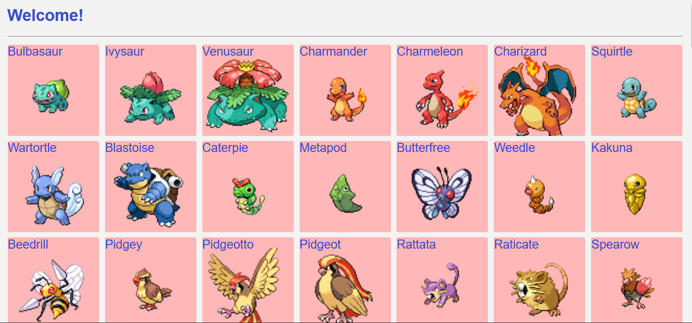
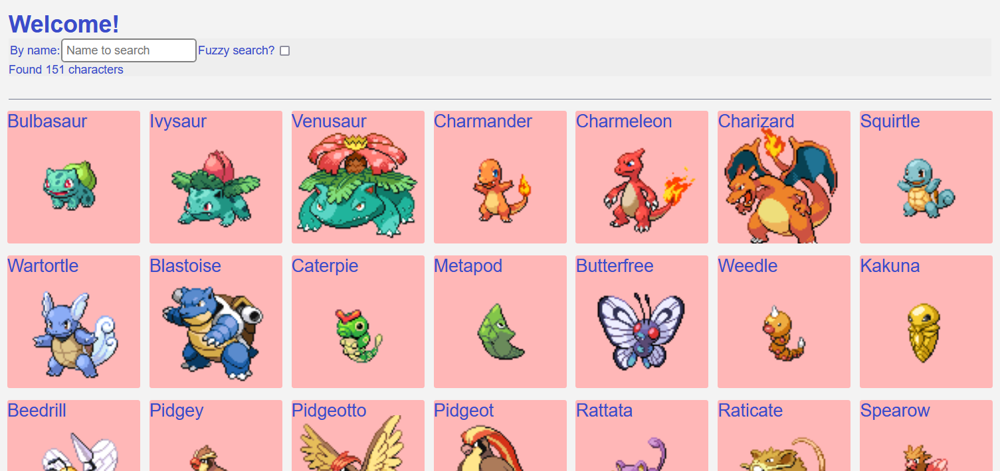
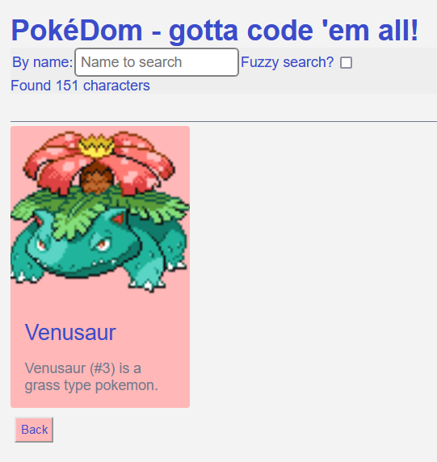
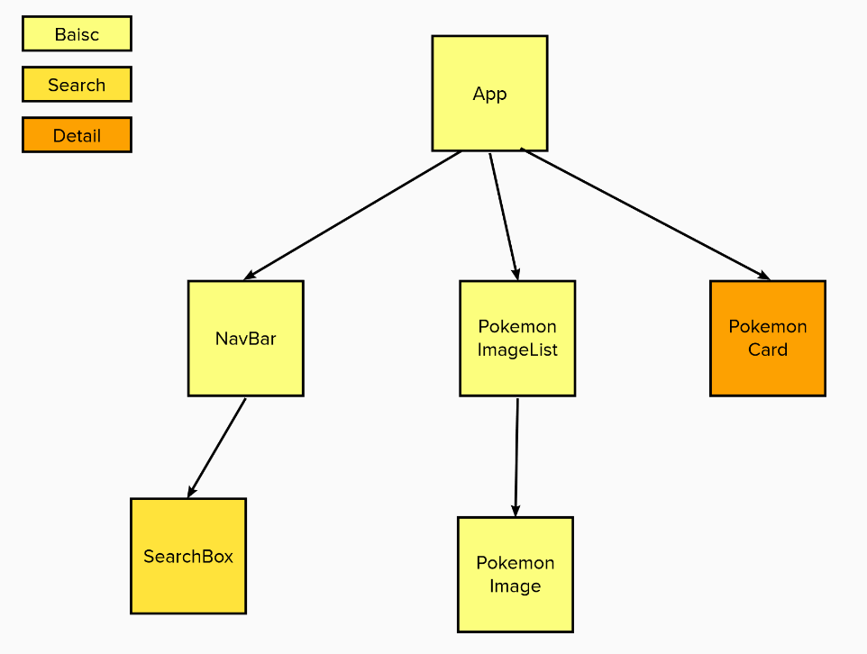

# React recap

A React recap using Pokemons! Again.

The aim is to build the previous Tech Test Pokemon page in React with some additional features.
Overall design, in three stages

- **Basic** - display the list of Pokemon characters, simplified, just the image and name, as a grid of cards.
- **Search** - adds a search box, with an optional fuzzy search
- **Detail** - added routes to allow a click through to a detail card

## Basic

## Search

Addition of a search box for searching Pokemon using name.

## Detail

Addition of a single Pokemon detail page, accessed via the link /pokemon/ID

## Component tree

